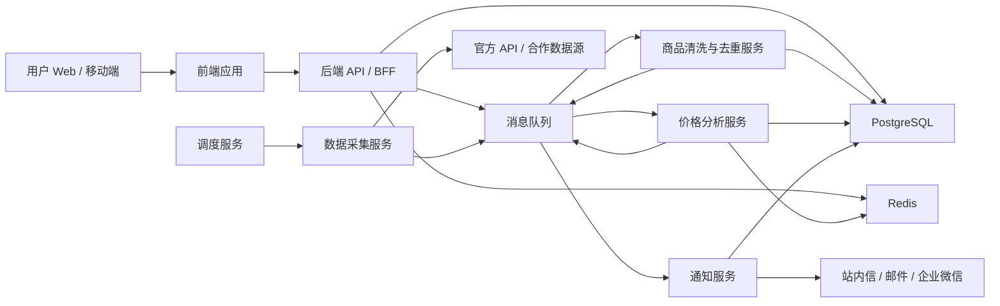
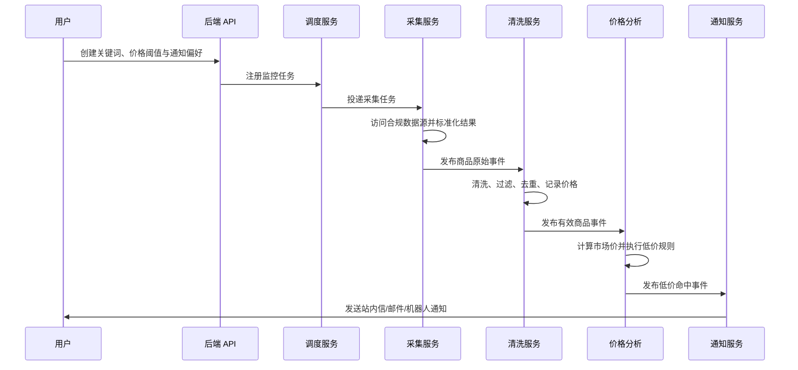

# 闲鱼低价商品监控系统技术方案设计文档

> 文档类型：技术方案设计 / Architecture & Technical Design
>
> 目标读者：产品、研发、测试、运维和安全评审人员
>
> 文档状态：Draft

## 1. 产品定位

### 1.1 目标用户

- 二手交易消费者：关注特定商品，希望及时发现低价优质商品。
- 数码、潮玩、摄影、乐器等垂类爱好者：对型号、成色和价格敏感。
- 职业买手/小型商家：需要持续发现可套利或可回收的商品。
- 收藏类用户：监控稀缺商品的上架和价格波动。

### 1.2 要解决的问题

闲鱼商品上新快、信息分散、价格差异大，人工反复搜索存在三个核心问题：

1. 发现不及时，低价商品可能在数分钟内被拍下。
2. 用户难以快速判断“低价”是否真实，标题、成色、配件和地区都会影响价格。
3. 用户无法持续追踪多个关键词、型号和价格阈值。

系统提供关键词级监控、市场价格基线、低价识别、及时通知和商品历史追踪能力。

### 1.3 MVP 定义

MVP 聚焦“发现并通知”，不涉及自动下单、代购、竞价或账号批量操作。

MVP 能力：

- 用户注册/登录。
- 创建关键词监控任务，设置目标价格、监控频率和通知渠道。
- 基于合法授权的数据源获取商品列表。
- 对商品进行去重、字段清洗和价格记录。
- 以“用户价格阈值 + 简单市场基线”判断低价。
- 通过站内通知和邮件/企业微信机器人发送提醒。
- 提供最近命中的商品列表与通知记录。

---

## 2. 系统整体架构

### 2.1 架构原则

- 合规优先：仅接入官方 API、合作数据源或用户明确授权的公开数据接口；不设计验证码绕过、反爬绕过、账号池或模拟下单能力。
- 采集与业务解耦：采集端、分析端和通知端独立扩缩容。
- 异步化：商品采集、价格分析、通知发送通过队列解耦。
- 可解释：每条低价命中必须保留价格基线、阈值和命中规则。
- 可演进：MVP 先使用规则引擎，后续再引入模型估价和个性化推荐。

### 2.2 系统架构图



### 2.3 前端

职责：

- 用户注册、登录和账号设置。
- 管理关键词监控任务。
- 查看商品命中、价格走势、通知历史。
- 管理通知偏好和风险提示。

建议形态：

- MVP：响应式 Web 管理台。
- Phase 2：PWA 或移动端应用。
- Phase 3：浏览器插件、企业版工作台及开放 API。

### 2.4 后端 API

职责：

- 用户、权限、会话与订阅管理。
- 关键词任务 CRUD。
- 商品查询和通知记录查询。
- 对前端提供聚合数据，例如“今日命中”“近期价格趋势”“任务健康状态”。
- 接收管理端配置，如数据源启停、规则版本和限流策略。

后端不直接执行耗时采集任务，避免 Web 请求与批处理互相影响。

### 2.5 数据采集服务

职责：

- 根据关键词监控任务拉取商品数据。
- 标准化不同数据源的商品结构。
- 控制数据源访问频率、失败重试和熔断。
- 发送原始商品事件到消息队列。

MVP 允许使用 Playwright 作为已授权数据源的浏览器执行层，但 Playwright 必须封装在 `datasource-sdk` 适配器中。业务服务不得直接依赖页面选择器、BrowserContext 或登录态文件；适配器只负责会话、页面读取和 `RawProductEvent` 输出。

Playwright 约束：

- 每个任务使用独立 BrowserContext，必要的授权会话通过受控 `storageState` 管理。
- 使用稳定定位器、有限超时、有限重试、trace 和 fixture 测试。
- 允许在测试中 mock 网络响应，或阻止非必要静态资源。
- 禁止验证码/风控绕过、指纹伪装、账号池、代理池、签名逆向、自动下单、抢拍和批量强聊。

数据来源优先级：

1. 闲鱼官方开放能力或获得书面授权的接口。
2. 合规的第三方数据服务。
3. 用户主动导入或授权的数据。

禁止范围：

- 绕过登录、验证码、设备指纹、风控限制。
- 批量控制用户账号。
- 使用未授权抓取方式获取受限制数据。
- 自动下单、自动支付或抢购。

### 2.6 数据处理服务

职责：

- 清洗标题、价格、地区、发布时间、成色、配件等字段。
- 解析价格表达，例如“999 元包邮”“一口价”“需补差价”。
- 识别无效、广告、求购、租赁、分期、定金等非可比商品。
- 商品去重与同商品多次采集更新。
- 写入商品主表和价格历史表。
- 触发价格分析任务。

### 2.7 价格分析服务

职责：

- 计算同关键词或同标准化商品的市场价格基线。
- 判断是否满足低价规则。
- 给出命中原因与置信度。
- 对同一商品、同一用户、同一时间窗口进行通知去重。

MVP 推荐采用混合规则：

`低价命中 = 当前价格 <= min(用户目标价, 市场中位价 × 折扣阈值)`

建议默认参数：

- 价格样本：近 7 天有效商品。
- 市场基线：中位价，降低极端低价和高价的干扰。
- 默认折扣阈值：70%。
- 最少可比样本数：10 条。
- 样本不足时，仅使用用户目标价，不标记“明显低于市场价”。

### 2.8 数据库存储

- PostgreSQL：用户、任务、商品、价格历史、通知记录、规则配置等核心事务数据。
- 对价格历史按月分区；数据量更大后可迁移至 ClickHouse 做分析型查询。
- 对象存储：仅在有合法授权、确有业务必要时保存商品图片缩略图或图片元数据。

### 2.9 缓存

Redis 用于：

- 用户会话、JWT 黑名单或 Token 状态。
- 热门关键词及商品详情缓存。
- 采集任务分布式锁。
- 请求限流和数据源配额计数。
- 通知幂等键与短时去重。
- 分析服务的市场价基线缓存。

### 2.10 消息通知

MVP 通知渠道：

- 站内通知。
- 邮件。
- 企业微信机器人或钉钉机器人。

通知内容：

- 商品标题、价格、市场价基线、低价比例。
- 成色、地区、发布时间等关键字段。
- 原始商品详情链接。
- 命中规则说明。

通知策略：

- 同一商品只通知一次，除非降价幅度达到新的阈值。
- 用户设置免打扰时段、每日上限和最低折扣。
- 渠道失败重试，超过阈值进入死信队列并记录。

### 2.11 定时任务

调度服务负责：

- 根据任务优先级和频率生成采集任务。
- 刷新市场价格基线。
- 过期数据归档与清理。
- 检查长时间无数据的监控任务。
- 重试失败采集和失败通知。
- 每日汇总、容量统计和异常告警。

任务频率建议：

- 免费用户：30 至 60 分钟。
- 付费用户：5 至 15 分钟，前提是数据源协议和配额允许。
- 高风险/高频任务：进入限流队列，防止集中访问数据源。

---

## 3. 技术选型

| 层级 | 选择 | 原因 |
|---|---|---|
| 编程语言 | TypeScript | 前后端统一类型体系，适合 I/O 密集型 API、任务编排和通知服务，招聘与维护成本低。 |
| 后端框架 | NestJS | 模块化、依赖注入、DTO 校验、OpenAPI 集成和队列支持成熟，适合中后台及服务化演进。 |
| 前端 | React + Next.js | 适合管理台、SSR/SEO 扩展、组件生态完整，便于后续 PWA 演进。 |
| ORM | Prisma 或 Drizzle | 类型安全、迁移规范、开发效率高；对复杂分析 SQL 保留原生 SQL 能力。 |
| 主数据库 | PostgreSQL 16 | 事务可靠、JSONB 灵活、索引和分区能力成熟，适合任务与商品历史数据。 |
| 缓存 | Redis 7 | 适合缓存、限流、分布式锁、任务状态和幂等去重。 |
| 消息队列 | RabbitMQ | 任务路由、确认机制、延迟重试和死信队列适合采集/分析/通知链路。MVP 任务量很小时可先使用 Redis Streams/BullMQ。 |
| 定时调度 | BullMQ Scheduler 或独立调度服务 | 与 TypeScript/Redis 集成成本低；规模扩大后可迁移到 Temporal 或 Kubernetes CronJob。 |
| 可观测性 | OpenTelemetry + Prometheus + Grafana + Sentry | 覆盖指标、链路、错误追踪和业务告警。 |
| 容器化 | Docker + Docker Compose | MVP 统一开发、测试和单机部署环境。 |
| 生产部署 | Docker 镜像 + Kubernetes 或云容器服务 | API、采集、分析、通知服务独立扩缩容，支持滚动发布和资源隔离。 |
| CI/CD | GitHub Actions/GitLab CI | 自动测试、镜像构建、安全扫描和灰度发布。 |

部署建议：

- 开发环境：Docker Compose，包含 `web`、`api`、`worker`、`postgres`、`redis`、`rabbitmq`。
- 生产环境：托管 PostgreSQL、托管 Redis、托管 RabbitMQ/云消息队列，应用以无状态容器部署。
- 采集服务单独部署在受控网络和独立资源池中，避免其异常影响用户 API。

---

## 4. 生产级项目目录结构

```text
xianyu-price-monitor/
├── apps/
│   ├── web/                         # Next.js 用户端与管理台
│   │   ├── src/
│   │   │   ├── app/
│   │   │   ├── components/
│   │   │   ├── features/
│   │   │   ├── lib/
│   │   │   └── types/
│   │   └── tests/
│   ├── api/                         # NestJS HTTP API
│   │   ├── src/
│   │   │   ├── modules/
│   │   │   │   ├── auth/
│   │   │   │   ├── users/
│   │   │   │   ├── monitors/
│   │   │   │   ├── products/
│   │   │   │   ├── notifications/
│   │   │   │   └── admin/
│   │   │   ├── common/
│   │   │   └── main.ts
│   │   └── test/
│   ├── collector-worker/             # 数据源连接与采集执行器
│   ├── processor-worker/             # 清洗、去重、入库
│   ├── analyzer-worker/              # 市场价计算与低价判定
│   ├── notifier-worker/              # 多渠道通知投递
│   └── scheduler/                    # 调度与周期性任务
├── packages/
│   ├── contracts/                    # DTO、事件消息与共享类型
│   ├── database/                     # Schema、迁移、仓储层
│   ├── pricing-engine/               # 价格规则与估值逻辑
│   ├── datasource-sdk/               # 合规数据源适配器接口
│   ├── queue/                        # 队列声明、重试、死信策略
│   ├── config/                       # 配置校验
│   ├── observability/                # 日志、指标、链路追踪
│   └── testing/                      # Mock、测试工具
├── infra/
│   ├── docker/
│   ├── compose/
│   ├── kubernetes/
│   ├── terraform/
│   └── monitoring/
├── docs/
│   ├── architecture/
│   ├── api/
│   ├── runbooks/
│   ├── security/
│   └── adr/
├── scripts/
├── .github/workflows/
├── docker-compose.yml
├── pnpm-workspace.yaml
└── README.md
```

---

## 5. 数据库设计

### 5.1 用户表 `users`

| 字段 | 类型 | 说明 |
|---|---|---|
| id | UUID | 主键 |
| email | VARCHAR(255) | 登录邮箱，唯一 |
| password_hash | VARCHAR(255) | 密码哈希；OAuth 用户可为空 |
| display_name | VARCHAR(100) | 显示名称 |
| status | SMALLINT | 正常、禁用、待验证 |
| plan_code | VARCHAR(32) | free/pro/enterprise |
| timezone | VARCHAR(64) | 用户时区 |
| notification_preferences | JSONB | 通知渠道、免打扰时段等 |
| created_at | TIMESTAMPTZ | 创建时间 |
| updated_at | TIMESTAMPTZ | 更新时间 |
| deleted_at | TIMESTAMPTZ | 软删除时间 |

索引：`email` 唯一索引，`plan_code + status` 联合索引。

### 5.2 关键词监控表 `keyword_monitors`

| 字段 | 类型 | 说明 |
|---|---|---|
| id | UUID | 主键 |
| user_id | UUID | 所属用户 |
| keyword | VARCHAR(200) | 原始搜索关键词 |
| normalized_keyword | VARCHAR(200) | 标准化关键词，用于聚合 |
| category_code | VARCHAR(64) | 可选类目 |
| target_price_cent | BIGINT | 用户可接受最高价，单位分 |
| discount_threshold | DECIMAL(5,4) | 相对市场价的折扣阈值，如 0.70 |
| min_sample_size | INTEGER | 最少可比商品数 |
| frequency_minutes | INTEGER | 采集频率 |
| filters | JSONB | 地区、成色、包邮、关键词排除项等 |
| notify_channels | JSONB | 邮件、站内信、机器人等 |
| status | SMALLINT | 启用、暂停、异常 |
| last_collected_at | TIMESTAMPTZ | 最近采集成功时间 |
| next_run_at | TIMESTAMPTZ | 下次调度时间 |
| created_at | TIMESTAMPTZ | 创建时间 |
| updated_at | TIMESTAMPTZ | 更新时间 |

索引：`user_id + status`、`status + next_run_at`、`normalized_keyword`。

### 5.3 商品表 `products`

| 字段 | 类型 | 说明 |
|---|---|---|
| id | UUID | 内部商品主键 |
| source | VARCHAR(32) | 数据来源标识 |
| source_product_id | VARCHAR(128) | 数据源商品 ID |
| canonical_key | VARCHAR(255) | 去重键，例如来源 + 商品 ID |
| title | VARCHAR(500) | 原始标题 |
| normalized_title | VARCHAR(500) | 清洗后的标题 |
| url | TEXT | 合法获取的原始链接 |
| seller_id_hash | VARCHAR(128) | 脱敏后的卖家标识 |
| current_price_cent | BIGINT | 当前价格，单位分 |
| original_price_cent | BIGINT | 划线价或原价，若有 |
| shipping_fee_cent | BIGINT | 运费 |
| condition_code | VARCHAR(32) | 成色/状态 |
| location | VARCHAR(128) | 地区 |
| category_code | VARCHAR(64) | 类目 |
| published_at | TIMESTAMPTZ | 原始发布时间 |
| last_seen_at | TIMESTAMPTZ | 最近发现时间 |
| status | SMALLINT | 在售、下架、未知 |
| raw_payload | JSONB | 原始数据，设置保留周期和访问权限 |
| created_at | TIMESTAMPTZ | 首次入库时间 |
| updated_at | TIMESTAMPTZ | 更新时间 |

约束：`source + source_product_id` 唯一。  
索引：`normalized_title` 全文索引、`current_price_cent`、`last_seen_at`、`category_code`。

### 5.4 价格历史表 `product_price_history`

| 字段 | 类型 | 说明 |
|---|---|---|
| id | BIGSERIAL | 主键 |
| product_id | UUID | 商品 ID |
| price_cent | BIGINT | 采集时价格 |
| shipping_fee_cent | BIGINT | 采集时运费 |
| observed_at | TIMESTAMPTZ | 观察时间 |
| source_event_id | UUID | 来源事件，用于幂等 |
| created_at | TIMESTAMPTZ | 写入时间 |

建议按 `observed_at` 月度分区。  
索引：`product_id + observed_at DESC`、`observed_at`。

### 5.5 通知记录表 `notification_records`

| 字段 | 类型 | 说明 |
|---|---|---|
| id | UUID | 主键 |
| user_id | UUID | 接收用户 |
| monitor_id | UUID | 命中的监控任务 |
| product_id | UUID | 关联商品 |
| channel | VARCHAR(32) | 站内信、邮件、企业微信等 |
| event_type | VARCHAR(32) | 首次低价、再次降价、任务异常等 |
| rule_version | VARCHAR(32) | 命中规则版本 |
| product_price_cent | BIGINT | 当时商品价格 |
| market_price_cent | BIGINT | 当时市场基线 |
| discount_rate | DECIMAL(6,4) | 当前价/市场价 |
| reason | JSONB | 命中依据、样本量、排除项等 |
| idempotency_key | VARCHAR(255) | 防重复通知 |
| delivery_status | SMALLINT | 待发送、成功、失败、放弃 |
| provider_message_id | VARCHAR(255) | 渠道方消息 ID |
| retry_count | INTEGER | 重试次数 |
| sent_at | TIMESTAMPTZ | 发送时间 |
| created_at | TIMESTAMPTZ | 创建时间 |

约束：`idempotency_key` 唯一。  
索引：`user_id + created_at DESC`、`monitor_id + created_at DESC`、`delivery_status`。

### 5.6 推荐补充表

- `monitor_runs`：记录每次任务执行、耗时、结果数和错误信息。
- `datasource_credentials`：加密保存授权数据源凭据及配额状态。
- `price_baselines`：保存关键词/类目/型号维度的市场价基线和样本统计。
- `audit_logs`：管理操作、规则变更、权限和敏感数据访问审计。
- `subscriptions`：套餐、账单、额度、到期与续费状态。

---

## 6. 核心业务流程



### 6.1 用户添加关键词

输入：

- 关键词。
- 目标价格。
- 可选筛选条件：类目、地区、成色、包邮、排除词。
- 监控频率和通知渠道。

处理：

1. 校验用户套餐额度、关键词长度和频率限制。
2. 关键词标准化，包括大小写、空格、同义词映射等。
3. 创建监控任务。
4. 初始化下次执行时间，并可立即投递一次低优先级采集任务。
5. 返回任务状态与预计首次结果时间。

输出：已创建的监控任务。

### 6.2 系统采集商品

输入：可执行的监控任务。

处理：

1. 调度器按 `next_run_at` 和用户优先级选择任务。
2. 获取数据源访问配额和分布式锁。
3. 调用适配器访问授权数据源。
4. 统一转换为内部 `RawProductEvent`。
5. 将原始事件发送到消息队列。
6. 更新任务执行记录与下次运行时间。

输出：商品原始事件、采集执行记录。

### 6.3 商品清洗

输入：原始商品事件。

处理：

1. 校验必填字段、价格合法性和链接格式。
2. 清理 HTML、冗余符号、营销词。
3. 解析标题、价格、运费、地区、成色和发布时间。
4. 过滤求购、租赁、定金、配件、虚假低价等规则命中商品。
5. 根据 `source + source_product_id` 或指纹去重。
6. 更新商品主记录，写入新的价格历史。

输出：标准化商品及有效商品事件。

### 6.4 价格分析

输入：标准化商品、匹配的关键词监控任务。

处理：

1. 根据关键词、类目、型号、成色等维度查找可比样本。
2. 过滤异常价、失效商品、样本不足或可比性差的商品。
3. 计算中位价、四分位距、样本量和置信度。
4. 执行低价规则。
5. 生成可解释的命中结果。

输出：低价命中事件或未命中结果。

### 6.5 判断低价

建议采用分层规则：

| 判定层 | 条件 | 目的 |
|---|---|---|
| 基础有效性 | 价格、标题、链接、状态完整 | 排除脏数据 |
| 非交易过滤 | 求购、租赁、定金、配件等 | 避免伪低价 |
| 用户阈值 | 商品价小于等于用户设定价 | 满足明确需求 |
| 市场基线 | 商品价低于中位价一定比例 | 识别明显低价 |
| 异常检测 | 价格低到不合理、关键词不匹配 | 降低欺诈和误报 |
| 幂等控制 | 同商品同规则未通知过 | 避免骚扰用户 |

推荐评分：

- `price_score`：低于市场价的幅度。
- `similarity_score`：商品标题与监控关键词的语义/词法相似度。
- `quality_score`：成色、配件、描述完整度。
- `risk_score`：异常低价、敏感词、信息缺失等风险。

最终仅当 `price_score` 足够高、`similarity_score` 合格且 `risk_score` 低时触发高优先级通知。

### 6.6 发送通知

输入：低价命中事件。

处理：

1. 读取用户通知偏好和免打扰策略。
2. 生成幂等键：`用户 + 任务 + 商品 + 规则版本 + 价格区间`。
3. 若已发送则跳过。
4. 按用户渠道偏好投递。
5. 记录投递结果；失败后按退避策略重试。
6. 超过最大重试次数进入死信队列并触发内部告警。

输出：通知记录与渠道投递状态。

---

## 7. 开发阶段规划

### Phase 1：MVP

目标：验证用户是否愿意为“低价发现 + 及时提醒”付费。

- 用户认证、基础权限和套餐额度模型。
- 关键词监控任务 CRUD。
- 接入一个合法数据源。
- 商品标准化、去重、价格历史记录。
- 基于用户阈值和中位价的规则引擎。
- 站内信与邮件通知。
- 基础管理后台：任务运行情况、失败记录、数据源状态。
- Docker Compose、本地环境、日志、错误追踪和基础监控。
- 单元测试、集成测试和端到端关键链路测试。

验收指标：

- 创建任务后可在约定频率内产生采集结果。
- 商品低价命中可在处理链路完成后 1 分钟内通知。
- 通知重复率低于 1%。
- 采集失败、通知失败可审计、可重试。

### Phase 2：优化

目标：提升命中准确率、稳定性和用户留存。

- 多数据源适配与故障切换。
- 类目、型号、成色和配件的结构化识别。
- 同义词词库、排除词、品牌型号词典。
- 异常价格识别与反欺诈提示。
- 市场价格趋势、价格走势图和历史最低价。
- 企业微信、钉钉、Telegram 等更多通知渠道。
- 通知摘要、收藏、忽略和反馈闭环。
- 数据分区、读写优化、消费者水平扩展。
- 监控告警、链路追踪、SLO 和运行手册。
- 更精细的频率、额度、优先级和限流机制。

### Phase 3：商业化

目标：建立可持续营收与平台化能力。

- 订阅套餐：监控词数量、频率、通知渠道、历史数据深度分级。
- 垂类高级估价：数码、摄影、潮玩、奢品等。
- 智能估价模型与“值得买”评分。
- 团队协作、共享监控池、角色权限和审计。
- API、Webhook、浏览器插件。
- 商业报表：价格趋势、库存信号、热度变化。
- 企业客户隔离、私有化部署或专属数据源。
- 订单/支付系统、发票、续费、额度和客服后台。

---

## 8. 模块输入、输出、依赖与优先级

| 模块 | 输入 | 输出 | 依赖 | 优先级 |
|---|---|---|---|---|
| 用户与鉴权 | 注册信息、登录凭据 | 会话、用户身份、权限 | PostgreSQL、Redis、邮件服务 | P0 |
| 关键词监控 | 关键词、价格阈值、筛选项 | 监控任务、调度计划 | 用户模块、PostgreSQL、调度服务 | P0 |
| 调度服务 | 启用任务、运行时间 | 采集任务 | Redis、队列、任务表 | P0 |
| 数据源适配 | 采集任务、授权凭据 | 原始商品事件 | 合规数据源、队列、限流器 | P0 |
| 商品清洗去重 | 原始商品事件 | 标准商品、价格历史 | PostgreSQL、规则配置、队列 | P0 |
| 价格分析 | 标准商品、可比样本、任务规则 | 低价命中结果、价格基线 | PostgreSQL、Redis、价格引擎 | P0 |
| 通知服务 | 低价命中事件、用户偏好 | 投递结果、通知记录 | 邮件/机器人服务、队列、PostgreSQL | P0 |
| 商品查询 | 用户查询条件 | 商品列表、价格走势 | PostgreSQL、Redis | P1 |
| 管理后台 | 任务与运行数据 | 数据源状态、审计、告警视图 | API、监控系统 | P1 |
| 模型估价 | 商品特征、历史样本 | 估价、置信度、风险评分 | 特征库、训练服务、分析数据库 | P2 |
| 计费订阅 | 套餐、支付回调 | 订阅状态、额度 | 支付服务、用户模块 | P2 |

---

## 9. 项目风险与应对

### 9.1 数据来源风险

风险：

- 平台没有适合的公开 API，或接口使用范围受限。
- 接口字段不稳定、配额变化、服务下线。
- 采集行为可能违反平台协议或触发法律风险。
- 原始商品数据中可能包含个人信息。

应对：

- 在立项前完成数据源合法性审查、合同确认和接口 SLA 评估。
- 实施数据源适配层，避免业务逻辑绑定单一来源。
- 只采集业务必要字段，卖家标识脱敏，设置数据保留期限。
- 提供数据源开关、配额保护、审计日志和降级策略。
- 数据源不可用时明确提示“数据延迟”，不能伪造实时性。

### 9.2 平台风控风险

风险：

- 高频访问导致来源 IP、凭据或应用被限制。
- 用户误以为系统具有抢购、自动下单能力。
- 异常低价可能是钓鱼、虚假商品或信息不完整导致。

应对：

- 严格遵循数据源协议与频率限制，不实现任何绕过机制。
- 依据套餐和数据源配额进行限流，采用退避重试和熔断。
- 通知中标注“价格信号，不代表商品真实性或成交保证”。
- 引入高风险商品过滤与风险评分，优先降低误报。
- 建立异常访问监控与人工处置流程。

### 9.3 性能与稳定性风险

风险：

- 热门关键词造成任务集中、消息堆积和数据库写入压力。
- 价格历史表快速增长。
- 通知渠道抖动导致重试风暴或重复通知。
- 市场价计算对大样本查询耗时较高。

应对：

- 使用队列削峰，按用户等级与关键词热度划分优先级。
- 采集、清洗、分析、通知服务独立扩缩容。
- 价格历史按时间分区，设置冷热数据分层和归档策略。
- 将市场基线预计算并缓存，避免在线全量聚合。
- 使用幂等键、指数退避、死信队列和通知频率上限。
- 定义 SLO：任务成功率、采集延迟、分析延迟、通知成功率。

### 9.4 低价判定准确率风险

风险：

- 标题含糊、配件缺失、成色不同导致市场价不可比。
- “低价”可能只是定金、租赁价、瑕疵价或虚假价。
- 新关键词样本不足，市场价基线不可靠。

应对：

- 在 MVP 中以规则透明、可解释为优先，不承诺智能估价准确性。
- 引入排除词、类目词典、价格异常区间和用户反馈。
- 样本不足时只按用户目标价触发，不输出市场价结论。
- 保存命中依据，允许用户标记“误报/有效”，持续迭代规则。
- Phase 2 后基于垂类建立差异化估价模型。

### 9.5 商业化风险

风险：

- 数据获取成本和频率受限，免费用户可能造成成本倒挂。
- 低价商品具备时效性，通知延迟会直接影响付费体验。
- 用户价值分层明显，通用功能难以支撑高客单价。
- 依赖单一平台会影响长期商业稳定性。

应对：

- 将采集频率、关键词数量、通知渠道和历史数据深度作为套餐权益。
- 优先经营高价值垂类，如数码、摄影、潮玩、乐器。
- 建立数据源成本、单位任务成本、通知成本和用户 LTV 看板。
- 产品定位为“发现和决策辅助”，避免承诺收益或成交结果。
- 架构预留多平台数据源能力，降低单平台依赖。

---

## 10. 关键非功能性要求

- 安全：密码使用强哈希，敏感凭据使用 KMS 加密，最小权限访问，接口限流和审计。
- 隐私：最小化采集和存储个人信息，提供数据导出、删除和保留策略。
- 可用性：MVP 目标月可用性 99.5%，核心通知链路具备重试和降级。
- 可观测性：监控采集成功率、队列堆积、分析耗时、通知成功率、任务延迟和数据源配额。
- 可测试性：价格规则必须有固定样本测试集；采集适配器使用契约测试；关键链路建立端到端测试。
- 可审计性：低价通知需能追溯到原始商品事件、规则版本、市场价样本统计和投递结果。

## 11. 结论与前置条件

该方案的关键前提是取得稳定、合法的数据访问能力。没有这一前提，系统即使技术上可实现，也不具备可持续运营条件。

建议在进入 Phase 1 开发前，完成以下评审：

1. 数据源授权、平台协议和个人信息处理合规评审。
2. 一个垂类和一条合法数据链路的可行性验证。
3. 低价判定样本集和误报/漏报评价标准。
4. 单用户、单任务和单次通知的成本测算。
5. MVP 的通知时效、命中准确率和可用性验收标准。
